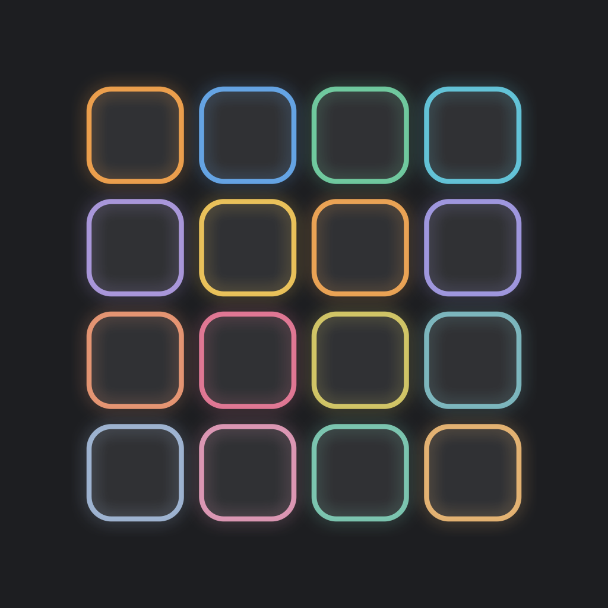
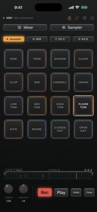
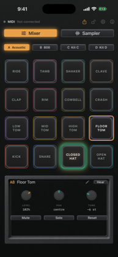
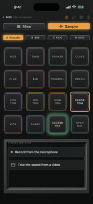
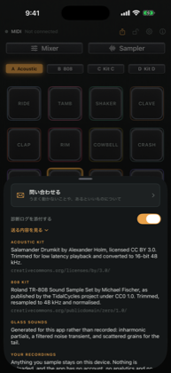

<div align="center">



# Starrypad

**A drum pad for iPhone that reads how hard you hit it, not where.**

Sixteen pads, an acoustic kit and an 808, a looper you play into, a sampler,
and USB MIDI in — on one screen, with nowhere to navigate to.

</div>

<div align="center">






</div>

---

## What it does

**Plays like an instrument.** The accelerometer reads the strike, so velocity
comes from how hard you hit rather than where on the pad you landed — a ghost
note is a ghost note. Two fingers land at once. The hi-hat chokes the way a
hi-hat does, and no two hits of the same sound are identical.

**Records without stopping the music.** Rec counts you in for a bar. Press it
while a loop is already playing and it waits for the bar line first, so nothing
you are hearing shifts. Undo peels off one pass round the loop, newest first,
rather than throwing away the take. Move the tempo mid-playback and the beat
holds still underneath you.

**Samples anything.** Record from the microphone or take the audio out of a
video, drag on the waveform to choose the part that sounds, drop it on a pad.
The original is kept, so the trim can be changed later.

**Lets go of what you made.** Export the loop as a WAV — bounced exactly one
loop long, with the tail of a hit near the end wrapped back to the top so it
loops seamlessly — or as a MIDI file on channel 10 with General MIDI note
numbers, ready to open in any DAW.

**Takes a controller.** Any class-compliant USB MIDI controller, plugged
straight into the phone.

Nothing leaves the device. No account, no analytics, no network code at all.

## How it is built

The parts worth knowing about, with the numbers they were measured at.

| | |
| --- | --- |
| **Scheduler** | A 1 ms timer on its own queue. The take is kept sorted and each tick finds its window by halving, not by scanning — a sequencer must never read the whole take a thousand times a second. |
| **Latency** | 2.67 ms buffer, measured on an iPhone 17e. |
| **Timing** | The count-in is anchored to the loop's own grid rather than to the tap, so its four clicks land on the last four beats of the lap: **+0.3 to +1.3 ms**. A whole arm/count/record cycle drifts **0.02–0.24 ms** at one, two and four bars. |
| **Velocity** | Logarithmic mapping with a 0.008 g floor and an adaptive ceiling, fitted to 138 real strikes — the first attempt used 0.06 g and threw away four hits in five. |
| **Voices** | 24 nodes: 23 for the pads and one held back for previews. Voices report when they finish, so a hit takes an idle one and only steals when all 23 are genuinely sounding. |
| **Master** | An EQ with no bands, for its global gain, into a peak limiter. It used to be arithmetic on the samples, which meant the knob answered on the next hit rather than this one. |
| **Take** | Capped at 2000 hits. Recording is open-ended, and without a ceiling a long roll puts tens of thousands of events in a list three things read on every frame. |
| **Crashes** | An unclean exit is noticed on the next launch; uncaught exceptions and signals are written with a backtrace from inside the dying process, by `write(2)` alone. |

The audio path is `voices → mixer → gain → limiter → main`. Connecting the
voices straight to the gain stage is what broke two earlier attempts: an effect
node has one input bus, so twenty-three players end up quietly unplugged.

### Where it came from

The desktop app it grew out of is
[purinzan/native-usb-drum-pad](https://github.com/purinzan/native-usb-drum-pad).
Roughly 7% of that codebase was platform-independent, so this is a rewrite in
Swift rather than a port. What is shared is the thinking, not the code: the
velocity curve, the floor expansion for controllers whose softest hit is 50,
and the colour tokens all come from there and are commented where they land.

## Building

Requires Xcode and [xcodegen](https://github.com/yonaskolb/XcodeGen)
(`brew install xcodegen`). The `.xcodeproj` is generated, not committed.

```bash
xcodegen generate
open Starrypad.xcodeproj
```

To run on a device from the command line, set `DEVELOPMENT_TEAM` in
`project.yml` to your own team, then:

```bash
xcodebuild -project Starrypad.xcodeproj -scheme Starrypad -configuration Debug \
  -destination "platform=iOS,id=<device-udid>" -allowProvisioningUpdates build
```

### One thing to check after touching `project.yml`

Samples are declared under `sources:` with `buildPhase: resources`. A target has
no `resources:` key — xcodegen ignores one silently, the build still succeeds,
and the app ships with an empty bundle. That failure is invisible until the app
runs and makes no sound, so check the count rather than the build result:

```bash
ls build/Build/Products/*/Starrypad.app/*.wav | wc -l   # expect 39
```

## Connecting a controller

Any class-compliant USB MIDI controller. On a USB-C device connect it directly
or through a USB-C adapter; on Lightning use the Camera Adapter. Bus-powered
controllers can draw more than a phone will supply — if the name never appears,
try a powered hub.

Notes are resolved in order, so no hit is ever dropped:

1. a layout you have taught it, if you have
2. the blocks a 4×4 controller usually sends — General MIDI from 36, the lower
   block from 20
3. the General MIDI kit table
4. anything still unrecognised takes the next free pad, in arrival order

Steps 2 and 3 already cover nearly every controller, which is why teaching one
lives in Settings rather than on the front: it is a once-per-controller errand
on a screen most people use with no controller at all.

## Licence

Code under [LICENSE](LICENSE) (MIT).

Audio samples have their own terms, recorded in
[LICENSE-SAMPLES](LICENSE-SAMPLES):

- **Acoustic kit** — Salamander Drumkit by Alexander Holm,
  [CC BY 3.0](https://creativecommons.org/licenses/by/3.0/). **Attribution is
  required**, and travels with the sounds: it is in the app behind the info
  button as well as here.
- **808 kit** — Michael Fischer's TR-808 sample set as published by TidalCycles,
  [CC0 1.0](https://creativecommons.org/publicdomain/zero/1.0/).
- **Glass sounds** — generated for this project and covered by its licence.
